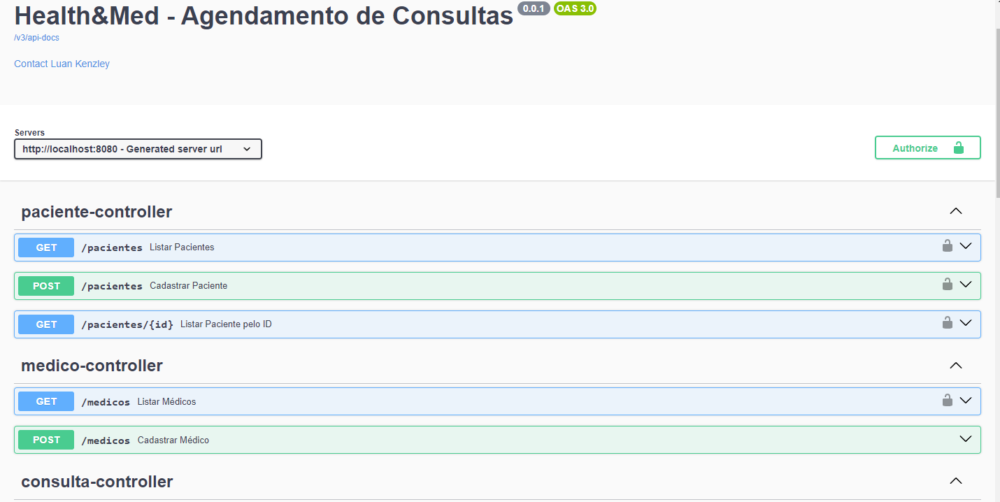

# Health-Med
Agendamento de Consultas Médicas

### [ASSISTA A APRESENTAÇÃO DO PROJETO ](https://youtu.be/AqLjU5A-KAM)
### Sumário

* [Tecnologias](#tecnologias)
* [Ferramentas utilizadas](#ferramentas-utilizadas)
* [Acessando a aplicação](#acessando-a-aplicação)
* [Autor](#autor)

## Tecnologias

[Voltar ao início](#sum%C3%A1rio)

* **Java 17**
* **Spring Boot 3**
* **MYSQL*

# Ferramentas utilizadas

[Voltar ao início](#sum%C3%A1rio)

* **IntelliJ IDEA Community Edition**
* **Docker**
* **Maven**

## Acessando a aplicação

[Voltar ao início](#sum%C3%A1rio)

Para acessar as aplicações e realizar um pedido, basta acessar a URL:

http://localhost:8000/swagger-ui.html

Você chegará nesta página:

As aplicações executarão nas seguintes portas:

* Health_med-API: 8080
* MYSQL (health_med)

[Voltar ao início](#sum%C3%A1rio)

## Autor

### Luan Kenzley
### Desenvolvedor de Software Back-End
